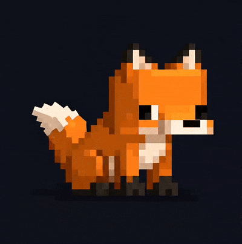

   
  <picture>
    <source media="(prefers-color-scheme: dark)" srcset="./assets/Fox_Dark.gif">
    <source media="(prefers-color-scheme: light)" srcset="./assets/Fox_Light.gif">
    
  </picture>
   
   

「 Hi, I'm Muhammad Ahmed Rayyan `console.log("rayyan")`, a professional overthinker of AI systems & a serial hackathon menace , shipping things out! 」

 •
 •
 •
 •
 •

   

Final year BS Artificial Intelligence student at [**SZABIST**](https://szabist.edu.pk/);  
Ex-Intern at [**AKUH**](https://www.aku.edu/), once taught a model to read MRI scans; 
Chronically unable to leave an idea as "just an idea", it has to become a repo.

- ⚙ Daily drivers: `.py`, `.ts`, `.tsx`, `.json`, `.ipynb`
- ⚡ Currently shipping: MLOps pipelines, multi-agent systems & things that probably didn't need 9 agents but got them anyway LOL!
- 💬 `ping` me about **agentic AI**, **MLOps**, **computer vision**, or why your last hackathon idea would've worked.
 

  Built with 💙 & running on 2 hours of sleep; debugging something. 🦊

